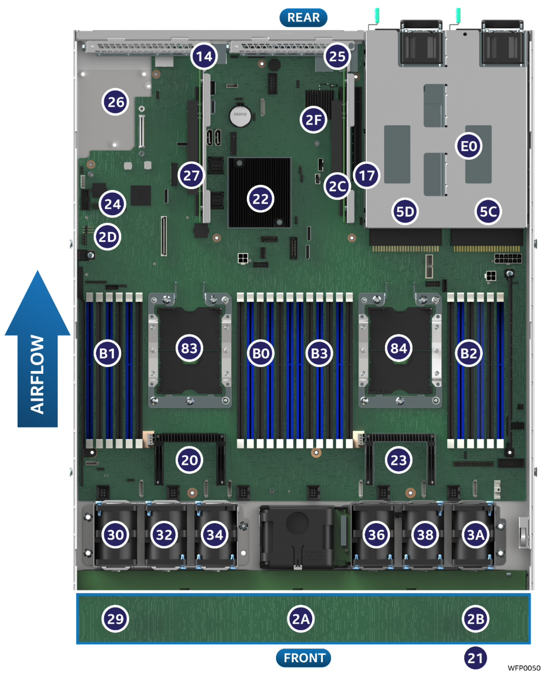
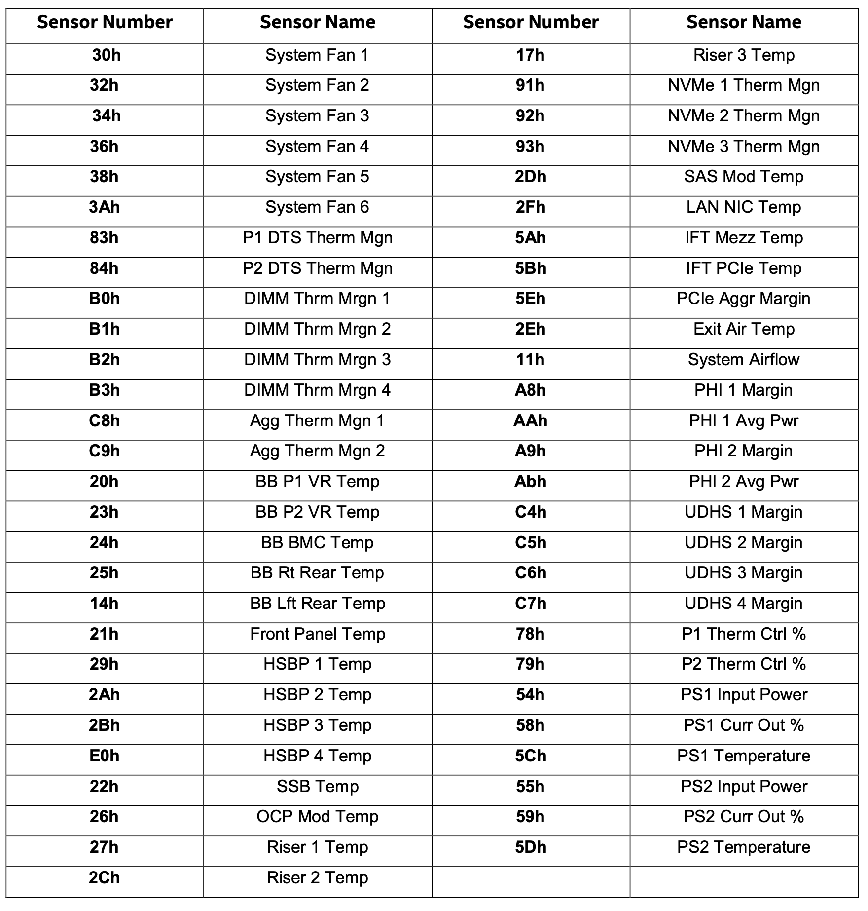

# IPMI Sensor 및 Units Table

|SENSOR|UNITS|CATEGORY|EXPLAIN|
|------|-----|-------|--------|
|System Airflow|Cubic Feet per Minute|??|분당 1세제곱 피트의 유체가 흐르는 양|
|BB Lft Read Temp|Degrees C|Temperature|??|
|BB P1 VR Temp|Degrees C|Temperature|??|
|Front Panel Temp|Degrees C|Temperature|패널 전면부 온도|
|SSB Temp|Degrees C|Temperature|??|
|BB P2 VR Temp|Degrees C|Temperature|??|
|BB BMC Temp|Degrees C|Temperature|??|
|BB Rt Rear Temp|Degrees C|Temperature|??|
|Riser 1 Temp|Degrees C|Temperature|Riser Slot Temperature|
|HSBP 1 Temp|Degrees C|Temperature|Hotswap Backplane|
|Exit Air Temp|Degrees C|Temperature|패널 후면부 온도|
|LAN NIC Temp|Degrees C|Temperature|??|
|System Fan 1A|RPM|Fan|보드 전면부 팬|
|System Fan 1B|RPM|Fan|보드 전면부 팬|
|System Fan 2A|RPM|Fan|보드 전면부 팬|
|System Fan 2B|RPM|Fan|보드 전면부 팬|
|System Fan 3A|RPM|Fan|보드 전면부 팬|
|System Fan 3B|RPM|Fan|보드 전면부 팬|
|System Fan 4A|RPM|Fan|보드 전면부 팬|
|System Fan 4B|RPM|Fan|보드 전면부 팬|
|System Fan 5A|RPM|Fan|보드 전면부 팬|
|System Fan 5B|RPM|Fan|보드 전면부 팬|
|System Fan 6A|RPM|Fan|보드 전면부 팬|
|System Fan 6B|RPM|Fan|보드 전면부 팬|
|MTT CPU1|Percent|??|??|
|MTT CPU2|Percent|??|??|
|PS1 Input Power|Watts|Power Supply|Power 1 Input Power|
|PS1 Curr Out %|Percent|Power Supply|Power 1 12V % of Maximun Current Output|
|PS1 Temperature|Degrees C|Power Supply|Power 1 Temperature|
|P1 Therm Ctrl %|Percent|Process|Process 1 Thermal Control|
|P2 Therm Ctrl %|Percent|Process|Process 2 Thermal Control|
|P1 DTS Therm Mgn|Degrees C|Temperature|CPU 1 Thermal Margin|
|P2 DTS Therm Mgn|Degrees C|Temperature|CPU 2 Thermal Margin|
|P1 Temperature|Degrees C|Process|Process 1 Temperature|
|P2 Temperature|Degrees C|Process|Process 2 Temperature|
|DIMM Thrm Mrgn 1|Degrees C|TemPerature|Memory Thermal Margin*|
|DIMM Thrm Mrgn 2|Degrees C|TemPerature|Memory Thermal Margin|
|DIMM Thrm Mrgn 3|Degrees C|TemPerature|Memory Thermal Margin*|
|DIMM Thrm Mrgn 4|Degrees C|TemPerature|Memory Thermal Margin|
|Agg Therm Mgn 1|Degrees C|Temperature|Aggregate Thermal Margin|
|Agg Therm Mgn 2|Degrees C|Temperature|Aggregate Thermal Margin|
|BB +12.0V|Volts|Voltage|Baseboard +12v|
|BB +3.3V Vbat|Volts|Voltage|Baseboard CMOS Battery|

## Reference

